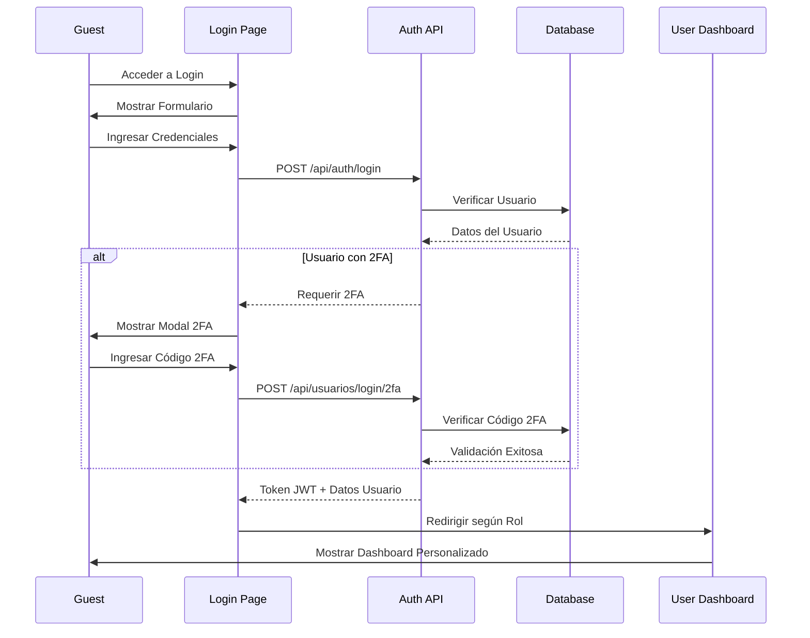
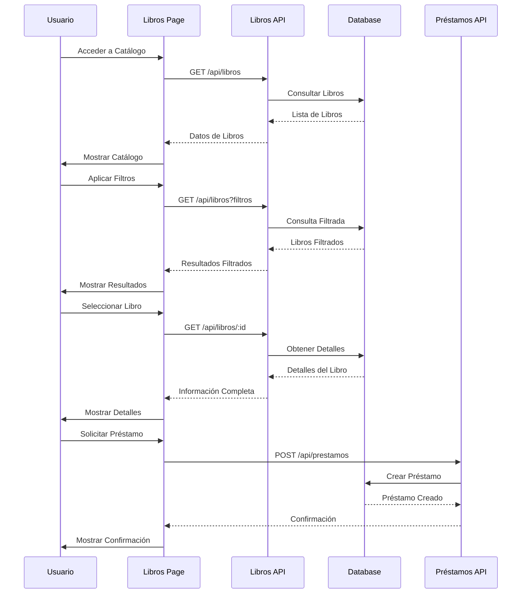

# 📚 Biblioteca Xonler - Sistema de Gestión de Bibliotecas Escolares

[](https://nodejs.org/)
[](https://postgresql.org/)
[](https://expressjs.com/)
[](LICENSE)

## 📋 Descripción

Biblioteca Xonler es un sistema integral de gestión de bibliotecas escolares que conecta múltiples bibliotecas de colegios en una red unificada. Permite a los estudiantes buscar, solicitar y gestionar préstamos de libros de cualquier biblioteca de la red, mientras que los administradores pueden gestionar completamente sus bibliotecas asignadas.

## ✨ Características Principales

### 🔐 Sistema de Autenticación
- **Registro e inicio de sesión** con validación robusta
- **Autenticación de dos factores (2FA)** con códigos TOTP
- **Gestión de roles** (usuario, admin, bibliotecario)
- **Tokens JWT** para sesiones seguras
- **Protección de rutas** basada en roles

### 👥 Gestión de Usuarios
- **Perfiles de usuario** completos con información personal
- **Sistema de roles** jerárquico
- **Preferencias personalizables** por usuario
- **Gestión de sesiones** con opción de "recordar"

### 📚 Gestión de Libros
- **Catálogo completo** de libros con metadatos detallados
- **Búsqueda avanzada** por título, autor, categoría, biblioteca
- **Sistema de recomendaciones** basado en historial
- **Gestión de inventario** por biblioteca
- **Categorización** y etiquetado de libros

### 🏫 Gestión de Bibliotecas
- **Múltiples bibliotecas** en una sola red
- **Administradores asignados** por biblioteca
- **Estadísticas individuales** por biblioteca
- **Gestión de inventario** independiente

### 📖 Sistema de Préstamos
- **Solicitud de préstamos** online
- **Seguimiento de estado** de préstamos
- **Notificaciones** de vencimiento
- **Historial de préstamos** completo
- **Gestión de devoluciones**

### 📊 Panel de Administración
- **Dashboard** con métricas clave
- **Estadísticas detalladas** con gráficos interactivos
- **Gestión de libros** y préstamos
- **Reportes exportables**
- **Configuración de biblioteca**

## 🏗️ Arquitectura del Sistema

### Backend (Node.js + Express)
```
src/
├── app.js                 # Configuración principal de Express
├── server.js             # Punto de entrada del servidor
├── config/
│   └── database.js       # Configuración de PostgreSQL
├── controllers/          # Lógica de negocio
│   ├── auth.controller.js
│   ├── usuarios.controller.js
│   ├── libros.controller.js
│   ├── prestamos.controller.js
│   └── admin-biblioteca.controller.js
├── middleware/
│   └── auth.js           # Middleware de autenticación
└── routes/               # Definición de rutas API
    ├── auth.routes.js
    ├── usuarios.routes.js
    ├── libros.routes.js
    └── admin-biblioteca.routes.js
```

### Frontend (HTML + CSS + JavaScript)
```
public/
├── pages/
│   ├── guest/            # Páginas públicas
│   │   ├── index.html
│   │   ├── login.html
│   │   └── contacto.html
│   ├── user/             # Panel de usuario
│   │   ├── index.html
│   │   ├── libros.html
│   │   └── configuracion.html
│   └── admin/            # Panel de administración
│       ├── index.html
│       ├── libros.html
│       ├── prestamos.html
│       └── estadisticas.html
├── services/             # Servicios del frontend
│   ├── auth.services.js
│   ├── libros.services.js
│   └── admin-biblioteca.services.js
└── css/                  # Estilos personalizados
    ├── main.css
    ├── components/
    └── layout/
```

### Base de Datos (PostgreSQL)
```sql
-- Tablas principales
usuarios              # Información de usuarios
roles                 # Roles del sistema
bibliotecas           # Información de bibliotecas
libros                # Catálogo de libros
biblioteca_libros     # Relación biblioteca-libro
prestamos             # Registro de préstamos
usuario_biblioteca    # Asignación admin-biblioteca
colegios              # Información de colegios
```

## 🚀 Instalación y Configuración

### Prerrequisitos
- **Node.js** 18+ 
- **PostgreSQL** 13+
- **npm** o **yarn**

### 1. Clonar el Repositorio
```bash
git clone https://github.com/Srpino/Biblioteca-Xonler.git
cd Biblioteca-Xonler
```

### 2. Instalar Dependencias
```bash
npm install
```

### 3. Configurar Base de Datos
```bash
# Crear base de datos PostgreSQL
createdb xonler

# Ejecutar esquema de base de datos
psql -U tu_usuario -d xonler -f db.sql
```

### 4. Configurar Variables de Entorno
```bash
# Copiar archivo de ejemplo
cp env.example .env

# Editar variables necesarias
nano .env
```

**Variables de entorno requeridas:**
```env
# Base de datos
DB_HOST=localhost
DB_PORT=5432
DB_NAME=xonler
DB_USER=tu_usuario
DB_PASSWORD=tu_password

# JWT
JWT_SECRET=tu_secreto_jwt_muy_seguro

# Servidor
PORT=3000

# Bcrypt
BCRYPT_ROUNDS=12
```

### 5. Configurar Sistema
```bash
# Ejecutar script de configuración
npm run setup
```

### 6. Iniciar Servidor
```bash
# Desarrollo
npm run dev

# Producción
npm start
```

El servidor estará disponible en `http://localhost:3000`

## 📖 Uso del Sistema

### Para Usuarios
1. **Registro**: Crear cuenta en `/login.html`
2. **Inicio de sesión**: Acceder con email y contraseña
3. **Explorar libros**: Buscar en el catálogo completo
4. **Solicitar préstamos**: Pedir libros prestados
5. **Gestionar perfil**: Actualizar información personal

### Para Administradores
1. **Acceso al panel**: Login con rol de administrador
2. **Gestión de libros**: Agregar, editar, eliminar libros
3. **Gestión de préstamos**: Ver y administrar préstamos
4. **Estadísticas**: Revisar métricas de la biblioteca
5. **Configuración**: Ajustar parámetros de la biblioteca

## 🔧 API Endpoints

### Autenticación
```
POST /api/auth/register     # Registro de usuario
POST /api/auth/login        # Inicio de sesión
GET  /api/auth/me          # Información del usuario actual
POST /api/auth/refresh     # Renovar token
```

### Usuarios
```
GET    /api/usuarios              # Listar usuarios
GET    /api/usuarios/:id          # Obtener usuario
PUT    /api/usuarios/:id          # Actualizar usuario
DELETE /api/usuarios/:id          # Eliminar usuario
```

### Libros
```
GET    /api/libros                # Listar libros
GET    /api/libros/:id            # Obtener libro
POST   /api/libros                # Crear libro
PUT    /api/libros/:id            # Actualizar libro
DELETE /api/libros/:id            # Eliminar libro
```

### Préstamos
```
GET    /api/prestamos             # Listar préstamos
GET    /api/prestamos/:id         # Obtener préstamo
POST   /api/prestamos             # Crear préstamo
PUT    /api/prestamos/:id         # Actualizar préstamo
```

### Administración
```
GET    /api/admin/biblioteca      # Info de biblioteca asignada
GET    /api/admin/estadisticas    # Estadísticas de biblioteca
POST   /api/admin/libros          # Agregar libro a biblioteca
```

## 🛡️ Seguridad

### Autenticación
- **JWT tokens** con expiración de 24 horas
- **Bcrypt** para hash de contraseñas (12 rounds)
- **2FA** opcional con códigos TOTP
- **Validación robusta** de entrada

### Autorización
- **Middleware de autenticación** en rutas protegidas
- **Control de roles** granular
- **Verificación de propiedad** de recursos
- **Protección CSRF** básica

### Validación
- **Sanitización** de entrada
- **Validación de tipos** de datos
- **Límites de tamaño** de archivos
- **Escape de SQL** con parámetros preparados

## 📊 Diagramas UML

### 👤 Casos de Uso - Usuario Autenticado

```mermaid
graph TB
    subgraph "Usuario Autenticado"
        A[Usuario] --> B[Iniciar Sesión]
        A --> C[Gestionar Perfil]
        A --> D[Explorar Libros]
        A --> E[Gestionar Préstamos]
        A --> F[Ver Estadísticas]
        A --> G[Cerrar Sesión]
    end
    
    subgraph "Gestión de Perfil"
        C --> C1[Ver Información Personal]
        C --> C2[Actualizar Datos]
        C --> C3[Cambiar Contraseña]
        C --> C4[Configurar 2FA]
        C --> C5[Gestionar Preferencias]
    end
    
    subgraph "Exploración de Libros"
        D --> D1[Buscar Libros]
        D --> D2[Filtrar por Categoría]
        D --> D3[Filtrar por Autor]
        D --> D4[Filtrar por Biblioteca]
        D --> D5[Ver Detalles del Libro]
        D --> D6[Ver Recomendaciones]
        D --> D7[Ver Libros Disponibles]
    end
    
    subgraph "Gestión de Préstamos"
        E --> E1[Solicitar Préstamo]
        E --> E2[Ver Préstamos Activos]
        E --> E3[Ver Historial de Préstamos]
        E --> E4[Ver Préstamos Vencidos]
        E --> E5[Renovar Préstamo]
        E --> E6[Cancelar Préstamo]
    end
    
    subgraph "Estadísticas Personales"
        F --> F1[Ver Préstamos Activos]
        F --> F2[Ver Libros Disponibles]
        F --> F3[Ver Bibliotecas Convenio]
        F --> F4[Ver Actividad Reciente]
    end
    
    subgraph "Autenticación"
        B --> B1[Login con Email/Password]
        B --> B2[Login con 2FA]
        B --> B3[Recordar Sesión]
        B --> B4[Recuperar Contraseña]
    end
```



### 🌐 Casos de Uso - Usuario Invitado (Guest)

```mermaid
graph TB
    subgraph "Usuario Invitado (Guest)"
        A[Guest] --> B[Explorar Sitio Web]
        A --> C[Registrarse]
        A --> D[Iniciar Sesión]
        A --> E[Contactar Soporte]
        A --> F[Ver Información General]
    end
    
    subgraph "Exploración del Sitio"
        B --> B1[Ver Página Principal]
        B --> B2[Leer Sobre Xonler]
        B --> B3[Ver Características]
        B --> B4[Ver Información de Contacto]
        B --> B5[Navegar por Enlaces]
    end
    
    subgraph "Proceso de Registro"
        C --> C1[Completar Formulario]
        C --> C2[Validar Email]
        C --> C3[Crear Contraseña]
        C --> C4[Confirmar Datos]
        C --> C5[Activar Cuenta]
    end
    
    subgraph "Proceso de Login"
        D --> D1[Ingresar Credenciales]
        D --> D2[Validar Datos]
        D --> D3[Completar 2FA si aplica]
        D --> D4[Acceder al Sistema]
    end
    
    subgraph "Soporte y Contacto"
        E --> E1[Ver Información de Contacto]
        E --> E2[Enviar Consulta]
        E --> E3[Ver Preguntas Frecuentes]
        E --> E4[Acceder a Ayuda]
    end
    
    subgraph "Información General"
        F --> F1[Ver Términos y Condiciones]
        F --> F2[Ver Política de Privacidad]
        F --> F3[Ver Acerca de Xonler]
        F --> F4[Ver Red de Bibliotecas]
    end
```



### 🔄 Flujo de Autenticación



### 📚 Flujo de Gestión de Libros (Usuario)



## 📊 Base de Datos

### Esquema Principal
```sql
-- Usuarios del sistema
CREATE TABLE usuarios (
    id BIGSERIAL PRIMARY KEY,
    nombre VARCHAR(100) NOT NULL,
    apellido VARCHAR(100) NOT NULL,
    email VARCHAR(255) UNIQUE NOT NULL,
    password_hash VARCHAR(255) NOT NULL,
    rol_id INTEGER REFERENCES roles(id),
    dobleautenticacion BOOLEAN DEFAULT false,
    preferencias JSONB DEFAULT '{}',
    created_at TIMESTAMP DEFAULT NOW()
);

-- Bibliotecas de la red
CREATE TABLE bibliotecas (
    id BIGSERIAL PRIMARY KEY,
    nombre VARCHAR(255) NOT NULL,
    direccion TEXT,
    telefono VARCHAR(20),
    email VARCHAR(255),
    colegio_id BIGINT REFERENCES colegios(id)
);

-- Libros del catálogo
CREATE TABLE libros (
    id BIGSERIAL PRIMARY KEY,
    titulo VARCHAR(255) NOT NULL,
    autor VARCHAR(255) NOT NULL,
    isbn VARCHAR(20),
    categoria VARCHAR(100),
    descripcion TEXT,
    portada_url VARCHAR(500)
);

-- Préstamos
CREATE TABLE prestamos (
    id BIGSERIAL PRIMARY KEY,
    usuario_id BIGINT REFERENCES usuarios(id),
    libro_id BIGINT REFERENCES libros(id),
    biblioteca_id BIGINT REFERENCES bibliotecas(id),
    fecha_prestamo DATE NOT NULL,
    fecha_devolucion DATE
);
```

## 🧪 Testing

```bash
# Ejecutar tests (cuando estén implementados)
npm test

# Tests de integración
npm run test:integration

# Coverage
npm run test:coverage
```

## 🚀 Despliegue

### Variables de Producción
```env
NODE_ENV=production
PORT=3000
DB_HOST=tu_host_produccion
DB_NAME=xonler_prod
JWT_SECRET=secreto_muy_seguro_produccion
```

### Docker (Opcional)
```dockerfile
FROM node:18-alpine
WORKDIR /app
COPY package*.json ./
RUN npm ci --only=production
COPY . .
EXPOSE 3000
CMD ["npm", "start"]
```

## 🤝 Contribución

1. Fork el proyecto
2. Crear rama para feature (`git checkout -b feature/nueva-funcionalidad`)
3. Commit cambios (`git commit -m 'Agregar nueva funcionalidad'`)
4. Push a la rama (`git push origin feature/nueva-funcionalidad`)
5. Abrir Pull Request

## 📝 Changelog

### v1.0.0
- ✅ Sistema de autenticación completo
- ✅ Gestión de usuarios y roles
- ✅ Catálogo de libros con búsqueda
- ✅ Sistema de préstamos
- ✅ Panel de administración
- ✅ Estadísticas y reportes
- ✅ Autenticación de dos factores
- ✅ Interfaz responsive

## 📄 Licencia

Este proyecto está bajo la Licencia ISC. Ver el archivo [LICENSE](LICENSE) para más detalles.

## 👥 Autores

- **Equipo Xonler** - *Desarrollo inicial* - [Srpino](https://github.com/Srpino)

## 🙏 Agradecimientos

- Bootstrap para el framework CSS
- Chart.js para las gráficas
- PostgreSQL para la base de datos
- Express.js para el backend
- Todos los contribuidores del proyecto

## 📞 Soporte

Para soporte técnico o preguntas:
- 📧 Email: info@xonler.edu
- 📱 Teléfono: (123) 456-7890
- 🐛 Issues: [GitHub Issues](https://github.com/Srpino/Biblioteca-Xonler/issues)

---

**Biblioteca Xonler** - Conectando el conocimiento a través de las bibliotecas escolares 📚✨
